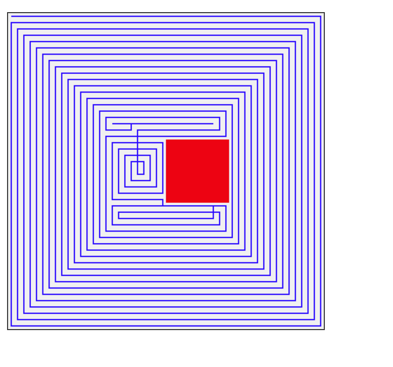
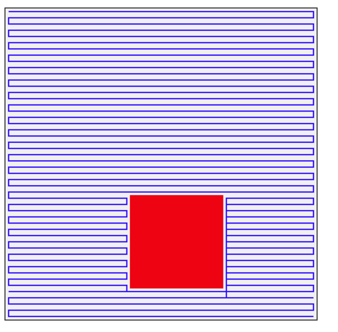

# Autonomous Wall-Finishing Robot Control System
### BE Intern Assignment | 10x Construction

> **[[Video Demo](https://drive.google.com/file/d/1iZOiDyW6G0zAGEfhvMEsN0FBCSyTI2K0/view?usp=drive_link)]**
> *(Please watch the video for a visual demonstration of the coverage path planning and architecture)*

## 1. Problem Statement
The objective was to design a robust, server-intensive control system for an autonomous wall-finishing robot. The system required:
* **Coverage Planning:** A 100% coverage path for a rectangular wall while strictly avoiding obstacles.
* **High-Performance Backend:** A FastAPI server handling intensive computations without blocking.
* **Optimized Data Storage:** Storing complex trajectory data efficiently in SQLite with indexing.
* **Visualization:** A custom 2D web visualization (No Matplotlib allowed).

## 2. The Engineering Journey: Evolution of the Algorithm
To achieve a robust industrial-grade path, I iterated through three distinct algorithmic approaches:

### Phase 1: Naive Boustrophedon (The "For Loop")
* **Approach:** Started with a simple double `for` loop iterating rows and columns.
* **The Failure:** Lacked spatial awareness. If an obstacle blocked a row, the path "teleported" across the obstacle, creating physically impossible moves.

### Phase 2: Greedy Search (The "Spiral Trap")
* **Approach:** Switched to a graph-based traversal where the robot moved to the nearest unvisited neighbor.
* **The Failure:** The robot would hug the obstacle walls, spiraling inward until it trapped itself in a corner (local minimum).

### Phase 3: Segment-Based Decomposition (The Final Solution)
* **Approach:** Implemented a **Segment-Based** approach:
    1.  Decompose the wall into horizontal "strips" of free space.
    2.  Finish an entire vertical zone (e.g., Left Side) before moving to the next.
    3.  Use **BFS (Breadth-First Search)** to intelligently navigate around obstacles when switching zones.
* **Result:** A clean, predictable path with zero overlaps and zero spirals.

## 3. System Architecture & Optimizations
Per the assignment requirements to include "overkill" optimizations:

### Backend: FastAPI + Async SQLAlchemy
* **Server-Intensive Handling:** utilized FastAPI `BackgroundTasks` to offload CPU-heavy path planning, ensuring the API remains non-blocking.
* **Structured Logging:** Implemented `structlog` for machine-readable JSON logs.

### Database: The O(1) Retrieval Strategy
* **The Optimization:** Instead of storing thousands of rows for one path, the system serializes and **compresses the trajectory into a Binary BLOB** (zlib).
* **The Result:** Trajectory retrieval is **O(1)** (constant time) regardless of path length.

### Frontend: Native Canvas API
* **Visualization:** Used HTML5 Canvas + JavaScript instead of Matplotlib.
* **Animation:** Implemented `requestAnimationFrame` for smooth trajectory playback.

